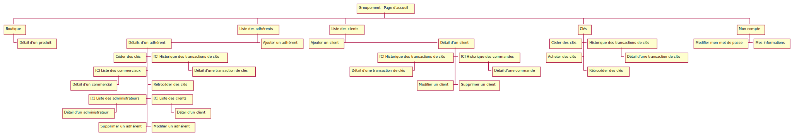
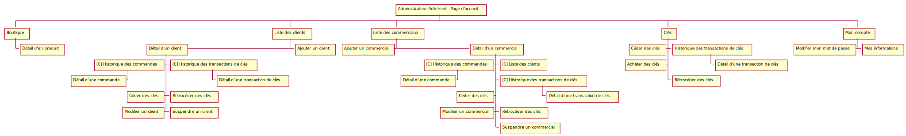
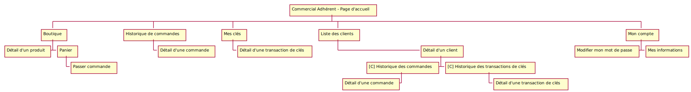
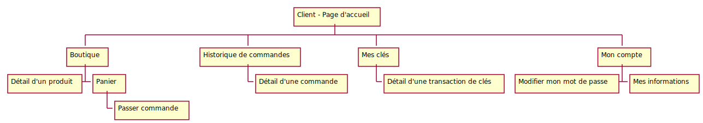
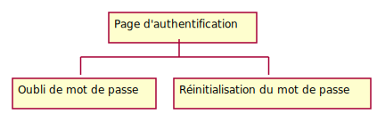

# Analyse de l'existent

[Retour au sommaire](index.md)

* [Types de sociétés](#types-de-socit)
* [Rôles](#rles)
* [Combinaison Type de société/Rôle](#combinaison-type-de-socitrle)
* [Groupement](#groupement)
* [Administrateur - Adhérent](#administrateur---adhrent)

## Types de société
* Groupement
* Adhérent
* Client (Garagiste/Carrossier)

## Rôles 
* Administrateur
* Commercial
* Client

*Note: on exclut volontairement le rôle de super admisnitrateur (LADR).*

## Combinaison Type de société/Rôle
* Groupement
    * Administrateur
* Adhérent
    * Administrateur
    * Commercial
* Client
    * Client
    
## Groupement

## Administrateur - Adhérent

## Commercial - Adhérent

## Client

## Visiteur

