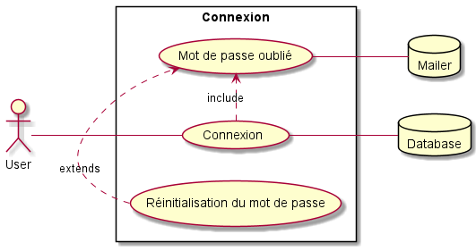
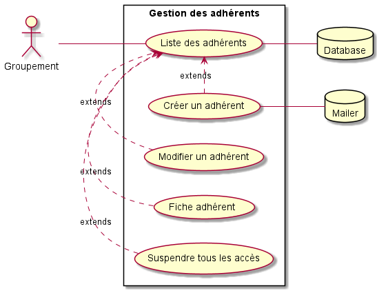
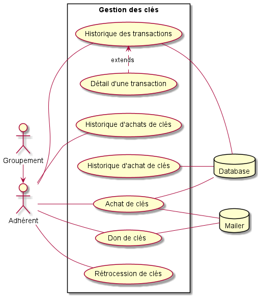
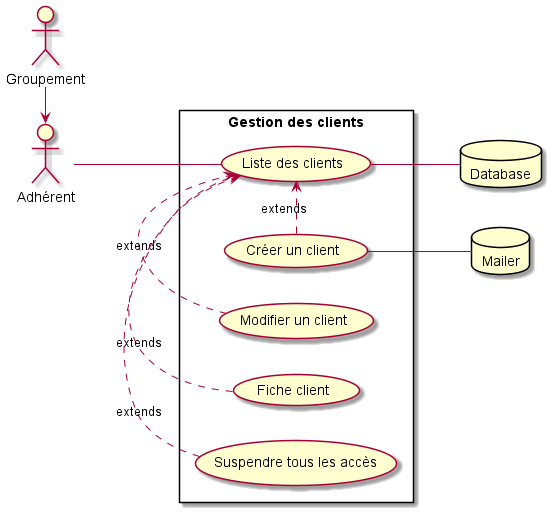
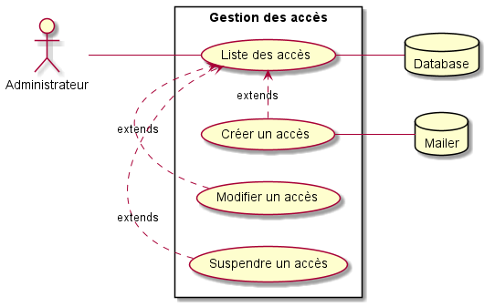
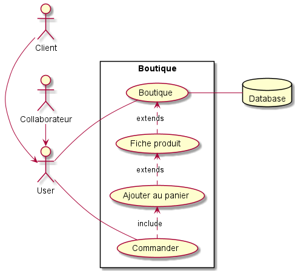
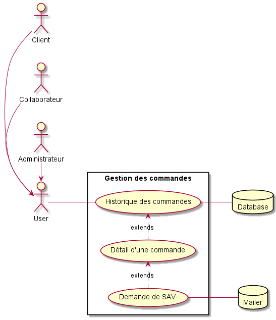
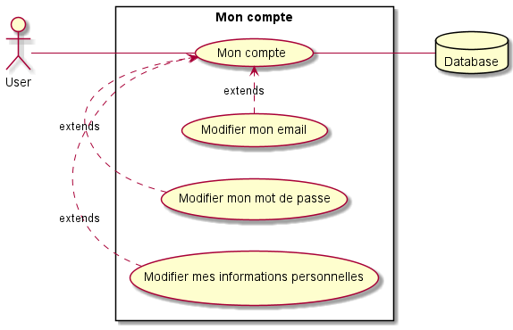
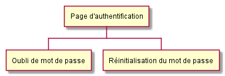
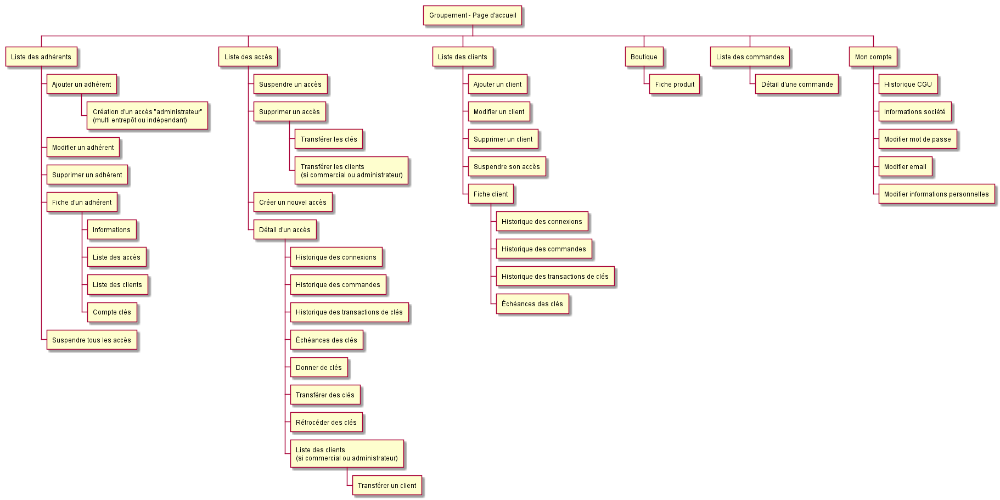

# UML

[Retour au sommaire](index.md)

* [Cas d'utilisation](#cas-dutilisation)
    * [Connexion](#connexion)
    * [Gestion des adhérents](#gestion-des-adhrents)
    * [Gestion des clés](#gestion-des-cls)
    * [Gestion des clients](#gestion-des-clients)
    * [Gestion des accès](#gestion-des-accs-commerciaux-et-collaborateurs)
    * [Boutique](#boutique)
    * [Gestion des commandes](#gestion-des-commandes)
    * [Mon compte](#mon-compte)

* [Sitemap](#sitemap)

## Cas d'utilisation

### Connexion
[](uml/v2/use_cases/login.puml)

#### Premier retour 
```
Prévoir un mot de passe initial sans caractères spéciaux et d’une longueur max de 10
caractères. Ce n’est pas un accès à protéger avec des mots de passe de fou. Ça nous évitera
trop de demandes d’aide car les utilisateurs ne respectent pas la casse.

A chaque demande de réinitialisation de mot de passe, prévoir d’envoyer en bcc un mail à
une adresse du type acces@keyprivilege.fr . Je veux pouvoir facilement manager le suivi de
ces réinitialisations et renvoyer si besoin le mail qu’un bénéficiaire affirme ne pas avoir reçu.
Si ce n’est pas par l’envoi d’un mail en bcc que ça se fait, je voudrais pouvoir disposer en
accès admin_LADR d’un espace où on retrouve l’ensemble des mails envoyés pour
facilement solutionner une demande d’un bénéficiaire qui râle car il ne reçoit pas nos
informations. A ce jour, ce n’est pas possible et c’est galère. Cela vaut pour les mails de suivi
de commandes de lots, de demande de contacts, de création d’accès…
```

### Gestion des adhérents
[](uml/v2/use_cases/adherents.puml)

#### Premier retour 
```
Même remarque que précédemment concernant la fonctionnalité « suppression »

L’admin groupement doit avoir la main pour créer différents types de profil.

    - L’admin groupement est bien entendu « admin » mais peut aussi décider de partager
ce rôle avec de nouveaux utilisateurs et peut donc potentiellement créer de
nouveaux accès admin

    - L’admin groupement peut logiquement créer une nouvelle entité. On reprend
l’exemple d’Aurélie JEANNETTE. Pour moi, à l’envoi de ses codes d’accès à Aurélie,
c’est moi en tant qu’admin LADR qui lui créé un accès et l’affecte nécessairement à
une raison sociale/à un adhérent. Exemple : IDLP. Aurélie reçoit un mail avec son
accès ; elle est admin de la raison sociale IDLP et elle peut immédiatement créer des
accès « Commercial », « Client Carrossier-Garagiste », « Collaborateur » pour cet
entrepôt IDLP. Comme on a créé son accès avec un rôle « Administrateur adhérent
multi-entrepôt », elle peut alors créer un nouvel entrepôt (exemple : NED ou Choisy
Pièces Auto) et à la création de ce nouvel entrepôt elle devra nécessairement y
associer un « admin ». Par défaut, on lui suggère « elle-même » et, si elle le souhaite,
elle peut aussi créer/ajouter un ou plusieurs autres admin.

     - L’admin groupement peut aussi créer des accès :
 « Commercial »
 « Collaborateurs »
 « Clients Carrossier-Garagiste »
```

### Gestion des clés
[](uml/v2/use_cases/cles.puml)

#### Premier retour 
```
Point-clé à garder en tête dans ce programme (et pour toute boutique de manière générale) : avoir un
bon suivi des dates d’échéance des clés créditées. A discuter avec Vincent. Les mouvements de clés
que ce programme peuvent nécessiter sont complexes d’un point de vue comptable. A nous de nous
prémunir de temps chronophages à venir pour déterminer et suivre les bonnes dates d’échéance
avant de nous lancer dans un chantier d’utilisateur des boutiques. Ça nous coûtera sinon bien trop
cher en temps par la suite.

La durée de validité des clés pourrait varier selon le choix des adhérents. On laisserait le
choix entre 1 an ou 2 ans. Je reboucle avec Vincent mais ce point est important dans la
gestion financière du programme et les dates d’échéance de validité des clés.

Pour moi, il manque une notion importante dans le use_case_cles, c’est une page clair et
détaillée de « Echéance Validité des clés ». Avec un système de filtres (mois, adhérent,
client), il est très important de pouvoir rapidement afficher ce récapitulatif.
```

### Gestion des clients
[](uml/v2/use_cases/clients.puml)

#### Premier retour 
```
Même remarque que précédemment concernant la fonctionnalité « suppression »
Dans Fiche client, on doit retrouver 3 aspects essentiels selon moi :
    - Coordonnées / Commercial affecté / Solde de clés / Stats de connexion
    - Suivi des commandes de lots passés
    - Récapitulatif des clés créditées-dépensées-à échéance

Règle de gestion : quand on supprime un accès et qu’il existe encore un solde créditeur, faire
poper un message de confirmation de la suppression sur lequel on indique que le montant
du solde et que celui-ci va être remonté au crédit compte de l’adhérent. Attention, la prise
en compte de la date d’échéance n’en est pas pour autant modifiée !!
```

### Gestion des accès (commerciaux et collaborateurs)
[](uml/v2/use_cases/acces.puml)

#### Premier retour 
```
Un admin peut aussi supprimer un accès. Dans ce cas-là, pour l’admin, il a l’impression
d’avoir supprimé un accès parce qu’il ne le voit plus. En réalité, il n’est pas supprimé de la
bdd et idéalement cet utilisateur supprimé doit même être visible sur un accès admin_LADR
pour nous puissions le gérer et le visualiser si besoin.
- En admin_LADR, dans le cas d’une suppression, on peut donc envisager la fonctionnalité
« restaurer » un utilisateur supprimé si un admin adhérent nous en fait la demande.
- Sans aller trop loin dans le détail de ce use_case, il est logique et important de disposer des
fonctions « renvoyer le mail de 1 ère connexion » ou encore « réinitialiser le mot de passe ».

Non obligatoire pour un adhérent d’ajouter des commerciaux. Par défaut, s’il n’y a pas de
commerciaux créés, à la création d’un accès client Carrossier-Garagiste, on propose un
rattachement du client au profil Admin
- Même remarque que précédemment concernant la fonctionnalité « suppression »
- Même remarque que précédemment concernant la remontée du solde créditeur de clés à la
suppression d’un accès « commercial »
- Prendre en compte qu’à la suppression d’un commercial, les clients qui étaient affectés à un
commercial doivent être réaffectés. Je partirai dans l’idée simple que c’est l’admin qui se
voient alors affectés immédiatement (provisoirement) les clients du commercial supprimé.
Puis que l’admin a ensuite la possibilité dans la gestion des clients de réaffecter un par un à
un autre ou à un nouveau commercial les clients concernés. A moins que tu ne trouves plus
simple à la suppression d’un accès commercial, de proposer une étape qui consisterait à
dire : voulez-vous sélectionner/créer un commercial pour lui affecter les clients actuellement
rattachés au commercial que vous supprimez ?
```

### Boutique
[](uml/v2/use_cases/boutique.puml)

#### Premier retour 
```
Bien penser à détruire/vider le panier de l’utilisateur quand il se déconnecte. Entre 2
connexions, il est en effet possible que la mise à jour des produits fait que les lots ne sont
plus commandables…
```

### Gestion des commandes
[](uml/v2/use_cases/commandes.puml)

#### Premier retour 
```
Comme évoqué précédemment, il serait utile de consulter via notre back-office admin_LADR
l’ensemble des mails liés à une commande pour faciliter notre bon suivi. Ça manque
cruellement sur nos boutiques actuelles.
- Travailler en UX avec Tim pour offrir aux différents accès une consultation agréable et
complète du suivi des commandes passées :
    - Quand je suis Client Carrossier-Garagiste
    - Quand je suis Commercial et que je veux visualiser les commandes de mes clients
    - Quand je suis Adhérent mono-entrepôt et que je veux visualiser les commandes de
mes clients et/ou de mes commerciaux et/ou de mes collaborateurs
    - Quand je suis Adhérent multi-entrepôt et qu’on ajoute la dimension de visualiser
tout cela par entrepôt (IDLP, NED, Choisy Pièces Auto…).
```

### Mon compte
[](uml/v2/use_cases/compte.puml)

#### Premier retour 
```
Ce n’est pas explicite mais les informations liées aux adresses de livraison n’apparaissent pas
dans le use_case. Est-ce que c’est une rubrique à part ou est-ce qu’on les englobe dans « mes
informations personnelles »

Je pense à signaler une fonctionnalité intéressante selon moi pour les coordonnées de
livraison : proposer l’option d’ajouter un mail à prendre en compte pour le suivi des
commandes de lots. C’est proposé sur certains sites marchands et je trouve bien de savoir
que par défaut mon mail user est utilisé mais que je peux aussi ajouter un second mail pour
faciliter le suivi de l’acheminement de mes commandes par une seconde personne.

Dans mon compte, on doit aussi retrouver l’historisation des acceptations des version de
règlements. Dans plusieurs programmes, on a vu qu’on n’avait pas prévu le fait de faire
valider un règlement chaque année et/ou des avenants. On doit donc pouvoir gérer ça dans
nos bases de données (version d’un règlement, date d’acceptation) et permettre la
consultation du côté user.

Pour un accès Client Carrossier-Garagiste, c’est dans mon compte qu’on peut aussi ajouter
l’information du référant Key Privilege. Par défaut, ce serait idéalement les coordonnées du
commercial rattaché au client, sinon ce serait les coordonnées de l’admin Adhérent (sans
afficher/partager le numéro de téléphone dans ce cas-là).
```

## Sitemap

### Visiteur
[](uml/v2/sitemap/visiteur.puml)

### Groupement
[](uml/v2/sitemap/groupement.puml)
